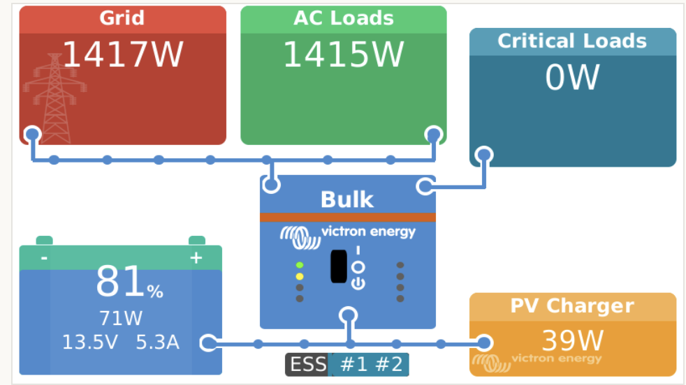
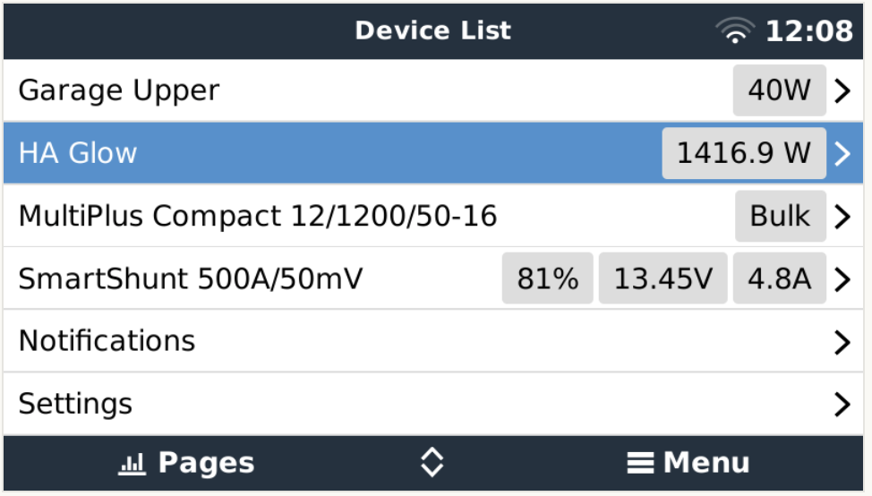
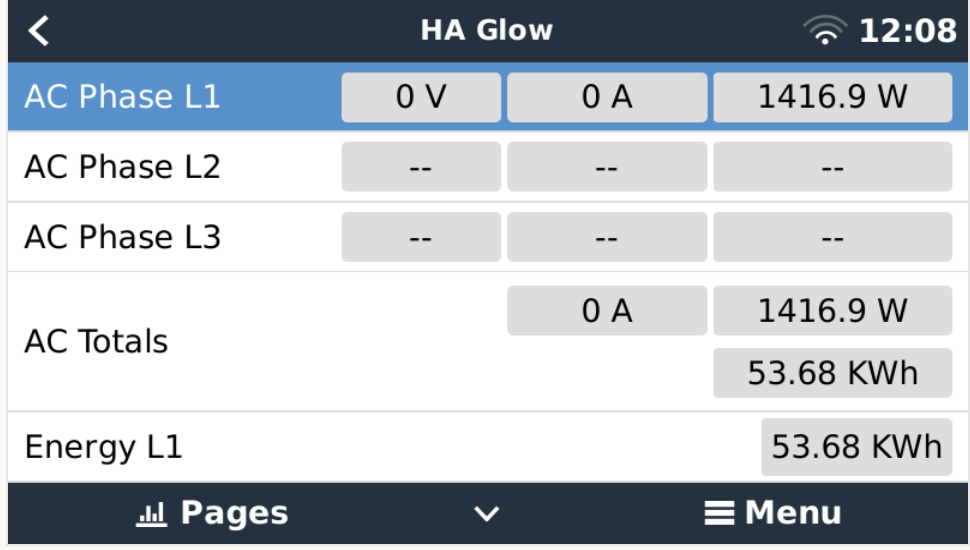
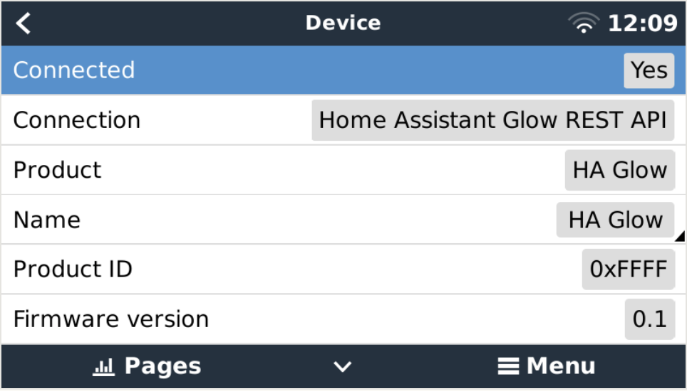

# victron-dbus-home-assistant-glow-smartmeter
Integrate Home Assistant's Glow meter into [Victron Energies Venus OS](https://github.com/victronenergy/venus). Originally forked from @fabian-lauer, there will be a lot of references of the EM3 in earlier commits of this main branch until a basic working edition is sorted

## Purpose
With the scripts in this repo it should be easy possible to install, uninstall, restart a service that connects the Shelly 3EM to the VenusOS and GX devices from Victron.
Idea was originally passed on @RalfZim project linked below, but I've forked it from @fabian-lauer project linked below. 


## Inspiration
This project is my first on GitHub and with the Victron Venus OS, so I took some ideas and approaches from the following projects - many thanks for sharing the knowledge:
- https://github.com/fabian-lauer/dbus-shelly-3em-smartmeter 
- https://github.com/RalfZim/venus.dbus-fronius-smartmeter
- https://github.com/victronenergy/dbus-smappee
- https://github.com/Louisvdw/dbus-serialbattery
- https://community.victronenergy.com/questions/85564/eastron-sdm630-modbus-energy-meter-community-editi.html


## How it works
### My setup
- Home Assistant Glow Meter
  - 3-Phase installation (normal for Germany)
  - Connected to Wifi network "A"

- Victron Energy Cerbo GX with Venus OS - Firmware v2.84
  - Victron Multiplus running latest firmware and latest ESS Assistant
  - Connected to Wifi network "A"

### Details / Process
As mentioned above the script is inspired by @RalfZim fronius smartmeter implementation.
So what is the script doing:
- Running as a service
- connecting to DBus of the Venus OS `com.victronenergy.grid.http_40`
- After successful DBus connection the Glow is accessed via the Event Source API - simply the /events is called and a realtime log is returned with all details
- A sample log file from a glow can be found [here](docs/espHomeEventSourceExample.log)
- (A sample JSON file from Shelly 3EM can be found [here](docs/shelly3em-status-sample.json))
- Serial/MAC is taken from the response as device serial
- Paths are added to the DBus with default value 0 - including some settings like name, etc
- After that a "loop" is started which pulls Shelly 3EM data every 750ms from the REST-API and updates the values in the DBus

Thats it 😄

### Pictures

 




## Install & Configuration
### Get the code
Just grap a copy of the main branche and copy them to `/data/dbus-shelly-3em-smartmeter`.
After that call the install.sh script.

The following script should do everything for you:
```
wget https://github.com/squircle12/victron-dbus-home-assistant-glow-smartmeter/archive/refs/heads/main.zip
unzip main.zip "victron-dbus-home-assistant-glow-smartmeter/*" -d /data
mv /data/victron-dbus-home-assistant-glow-smartmeter /data/victron-dbus-home-assistant-glow-smartmeter
chmod a+x /data/victron-dbus-home-assistant-glow-smartmeter/install.sh
/data/victron-dbus-home-assistant-glow-smartmeter/install.sh
rm main.zip
```
⚠️ Check configuration after that - because service is already installed an running and with wrong connection data (host, username, pwd) you will spam the log-file

### Change config.ini
Within the project there is a file `/data/victron-dbus-home-assistant-glow-smartmeter/config.ini` - just change the values - most important is the host, username and password in section "ONPREMISE". More details below:

| Section  | Config vlaue | Explanation |
| ------------- | ------------- | ------------- |
| DEFAULT  | AccessType | Fixed value 'OnPremise' |
| DEFAULT  | SignOfLifeLog  | Time in minutes how often a status is added to the log-file `current.log` with log-level INFO |
| ONPREMISE  | Host | IP or hostname of on-premise Shelly 3EM web-interface |
| ONPREMISE  | Username | Username for htaccess login - leave blank if no username/password required |
| ONPREMISE  | Password | Password for htaccess login - leave blank if no username/password required |


## Used documentation
- https://github.com/victronenergy/venus/wiki/dbus#grid   DBus paths for Victron namespace
- https://github.com/victronenergy/venus/wiki/dbus-api   DBus API from Victron
- https://www.victronenergy.com/live/ccgx:root_access   How to get root access on GX device/Venus OS

## Discussions on the web
This module/repository has been posted on the following threads:
- https://community.victronenergy.com/questions/125793/shelly-3em-smartmeter-with-venusos-cerbo-gx.html
